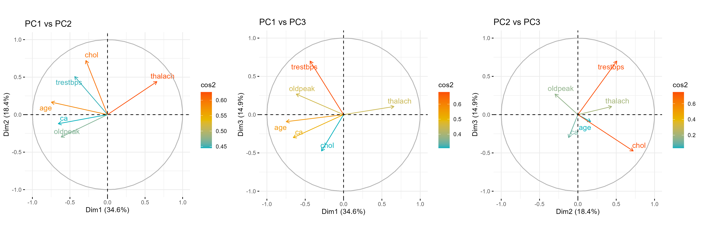

# Predict Presence of a Heart Disease

Coronary heart disease (CHD) involves the reduction of blood flow to the heart muscle due to build-up of plaque in the arteries of the heart. It is the most common form of cardiovascular disease. Currently, invasive coronary angiography represents the gold standard for establishing the presence, location, and severity of CAD, however this diagnostic method is costly and associated with morbidity and mortality in CAD patients. Therefore, it would be beneficial to develop a non-invasive alternative to replace the current gold standard.

Other less invasive diagnostics methods have been proposed in the scientific literature including exercise electrocardiogram, thallium scintigraphy and fluoroscopy of coronary calcification. However the diagnostic accuracy of these tests only ranges between 35%-75%. Therefore, it would be beneficial to develop a computer aided diagnostic tool that could utilize the combined results of these non-invasive tests in conjunction with other patient attributes to boost the diagnostic power of these non-invasive methods with the aim ultimately replacing the current invasive gold standard.

In this vein (pun intended), the following dataset comprises 303 observations, 13 features and 1 target attribute. The 13 features include the results of the aforementioned non-invasive diagnostic tests along with other relevant patient information. The target variable includes the result of the invasive coronary angiogram which represents the presence or absence of coronary artery disease in the patient with 0 representing absence of CHD and labels 1-4 representing presence of CHD. Most research using this dataset have concentrated on simply attempting to distinguish presence (values 1,2,3,4) from absence (value
0).

## Dimension Reduction : Principal Componenet Analysis (PCA)

Citation - Janosi, A., Steinbrunn, W., Pfisterer, M., & Detrano, R. (1989). Heart Disease [Dataset]. UCI Machine Learning Repository. https://doi.org/10.24432/C52P4X.

